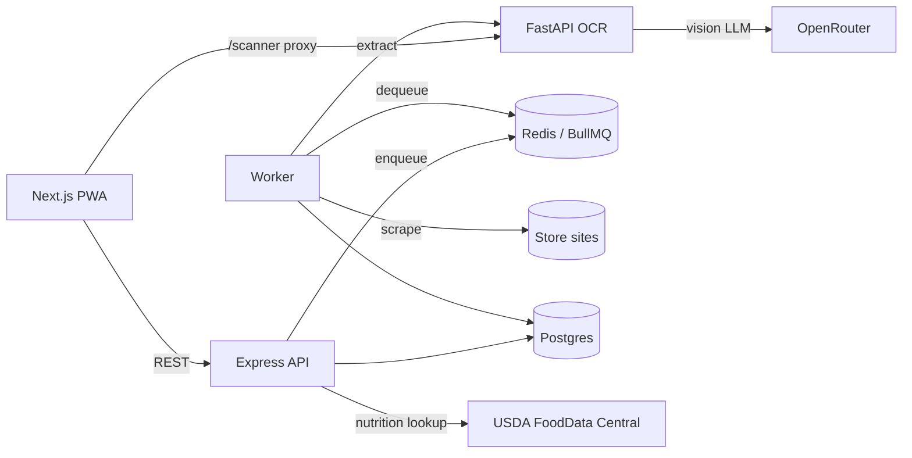
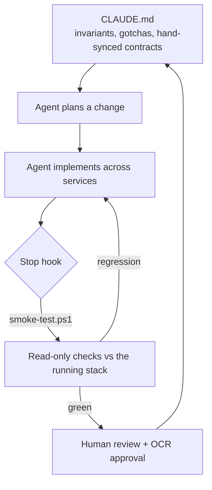

# FoodTracker

**Grocery price-intelligence + calorie tracking, built as a polyglot microservice stack — and developed with a disciplined agentic loop.**

FoodTracker turns photos of receipts and shelf tags into structured price data, tracks prices across stores, and doubles as a nutrition diary (with USDA FoodData Central lookup). It's a real, running system: six containers, three languages, a human-in-the-loop OCR pipeline, and a full audit/revert trail on every price mutation.

This README covers both **how the system works** and **how it's built** — the second half describes the agent loop used to develop it, which is the part I'm most deliberate about.

---

## Table of contents
- [Architecture](#architecture)
- [Data model](#data-model)
- [Running it](#running-it)
- [The agentic development loop](#the-agentic-development-loop)
- [Verification](#verification)
- [Conventions & invariants](#conventions--invariants)
- [Repo layout](#repo-layout)

---

## Architecture

Six containers orchestrated by `docker-compose.yml`. Each service is its own package — there is no root `package.json`, so services version and deploy independently.

| Service | Stack | Port | Role |
|---|---|---|---|
| `frontend` | Next.js 14 (App Router), TS, Tailwind | 3000 | PWA UI |
| `backend` | Express, TypeScript | 4000 | REST API; owns Postgres; enqueues jobs |
| `worker` | BullMQ + Playwright, Node/TS | — | Processes the scraping **and** OCR queues |
| `ocr-service` | FastAPI, Python 3.12 | 8000 (loopback) | Vision-LLM extraction via OpenRouter |
| `db` | Postgres 15 | 5432 | Relational data |
| `redis` | Redis 7 | 6379 | BullMQ queues |



**Two OCR ingestion paths, both ending in human review — nothing extracted is ever saved without a person approving it:**

1. **Synchronous** (`/scanner`): browser → Next.js proxy → `ocr-service` → structured result rendered in a review grid for edit/approve/commit.
2. **Background queue** (`/inbox`): browser → API (stores the image) → worker calls `ocr-service` → result held on a `scan_jobs` row → reviewed in the **same** shared review component.

The OCR service sends the image **directly to a vision model** (no Tesseract): one call classifies `receipt | price_tag | unknown` and extracts structured fields, with a reprompt-retry and graceful degradation for flaky free models.

---

## Data model

Core entities are **stores, foods, price_logs**; calorie tracking adds **food_nutrition, consumption_logs, user_goals**. A few decisions worth calling out because they show up throughout the code:

- **Many-to-many by design.** Foods relate to prices and nutrition through join tables (`food_prices`, `food_macros`), so one price observation or nutrition profile can be shared across foods. The origin `food_id` columns are retained for the audit trail and back-compat.
- **Audit + revert on every price mutation.** Create / update / delete each write a before/after JSONB snapshot in the same transaction as the mutation. Deletes are soft; reverts are themselves audited, so reverts are revertible.
- **History is immutable by snapshot.** Diary entries store the nutrient values computed *at log time* — editing a food's facts later never rewrites your history.
- **One array drives the schema.** The full nutrient column set is declared once (`NUTRIENT_FIELDS` in `backend/src/nutrition.ts`); the server builds its `INSERT` / `UPDATE` / `SUM` column lists from it. Adding a nutrient is a migration plus one array entry.

---

## Running it

Requires Docker and a `.env` (copy `.env.example`). Two API keys are optional but unlock features: `OPENROUTER_API_KEY` (OCR) and `FDC_API_KEY` (USDA nutrition lookup).

```bash
cp .env.example .env          # then fill in keys
docker compose up -d --build  # whole stack
```

- UI: http://localhost:3000
- API: http://127.0.0.1:4000/api/health
- Rebuild one service after editing it: `docker compose up -d --build backend`
- Follow logs: `docker compose logs -f worker`

**Schema note:** `db/schema.sql` only runs on a *fresh* Postgres volume. Migrations are written idempotently (`ADD COLUMN IF NOT EXISTS`, …) and applied to a running DB by hand via `psql` — documented in [CLAUDE.md](CLAUDE.md).

---

## The agentic development loop

This project is built with [Claude Code](https://claude.com/claude-code) as the primary implementer, driven by a **spec-first, verify-every-turn** loop rather than ad-hoc prompting. The scaffolding for that loop lives in the repo, not just in my head:



**1. `CLAUDE.md` is the living spec.** It's not a stale doc — it encodes the invariants an agent (or a new contributor) will otherwise get wrong: the three hand-synced cross-language contracts, the "schema.sql only runs on a fresh volume" trap, the pre-ES2015 iteration constraint in the frontend build, and the architectural rules (e.g. *there are exactly two input surfaces for price and macros; reuse them, don't fork*). Every non-obvious constraint learned during development is written back here, so the next change starts from accumulated context instead of rediscovering the same landmines.

**2. Every turn is verified.** A `Stop` hook (`.claude/settings.json`) runs `scripts/smoke-test.ps1` when the agent finishes a turn. The script hits the live backend and frontend with read-only checks — API contracts, the M:N join reads, diary micronutrient sums, USDA proxy, and every page returning 200. It's deliberately safe to run on a loop: it *skips* when the stack is down and only fails on a real regression, feeding the failure back to the agent to fix. No green, no done.

**3. Humans stay in the loop where it matters.** OCR is treated as an ingestion *supplement*, never an oracle: extracted items always pass through a review-and-approve step before they touch the database. The agent builds the pipeline; a person confirms the data.

**4. Single sources of truth over copy-paste.** Recurring logic is consolidated so a change lands in one place: two shared popup components for all price/macros entry (`PriceEditor`, `MacroEditor`), one `NUTRIENT_FIELDS` array driving both schema and SQL, one fuzzy matcher, one unit-normalization table per side of the wire. Where a contract *must* be duplicated across languages, it's labeled in-file and listed in `CLAUDE.md`.

The result is a loop where the agent can make cross-cutting changes (a new nutrient touches Postgres, Express, and two React surfaces) and immediately know whether it broke anything.

---

## Verification

There is no unit-test suite by design — this is an integration-heavy system where the meaningful signal is "does the running stack still honor its contracts." That signal is captured in `scripts/smoke-test.ps1`:

```bash
# runs automatically as a Stop hook; run it by hand any time:
powershell -File scripts/smoke-test.ps1
```

It gates on backend health, then asserts the foods/diary/goals/efficiency endpoints, the join-table reads, micronutrient aggregation, the USDA lookup, and all four pages. Exit `0` = green, `2` = regression, and it no-ops when the stack isn't running.

The same checks run in **CI** (`.github/workflows/smoke.yml`) via a portable bash twin, `scripts/smoke-test.sh`, so the "every change is verified" guarantee holds for outside contributors too — not just on my machine. CI boots only the services the checks need (`db`, `redis`, `backend`, `frontend`) and runs in strict mode, so a stack that fails to boot is a failing build.

---

## Conventions & invariants

The full list lives in [CLAUDE.md](CLAUDE.md). The load-bearing ones:

- **Two input surfaces, reused everywhere.** `PriceEditor` and `MacroEditor` are the only ways to enter a price or nutrition facts — launched from the dashboard, diary, inbox, and history. Don't build a third form.
- **Three hand-synced contracts** (OCR response shape, unit tables, nutrition scaling) are duplicated across languages and kept in sync by hand; each file says so.
- **Frontend build targets pre-ES2015 iteration** — use `Array.from(...)`, never `[...set]`.
- **Every "current price" query filters `deleted_at IS NULL`.**
- **`consumed_at` is a naive local timestamp** — the client owns timezone handling.

---

## Repo layout

```
backend/       Express API, audit trail, unit + nutrition + FDC logic
frontend/      Next.js PWA (dashboard, diary, scanner, inbox, history)
worker/        BullMQ consumer: Playwright scraper + OCR job runner
ocr-service/   FastAPI vision-LLM extraction
db/schema.sql  Idempotent schema + seed data
scripts/       smoke-test.ps1 (the verification loop)
.claude/       settings.json — the Stop hook wiring the loop
CLAUDE.md      The living spec: invariants, gotchas, architecture
```
