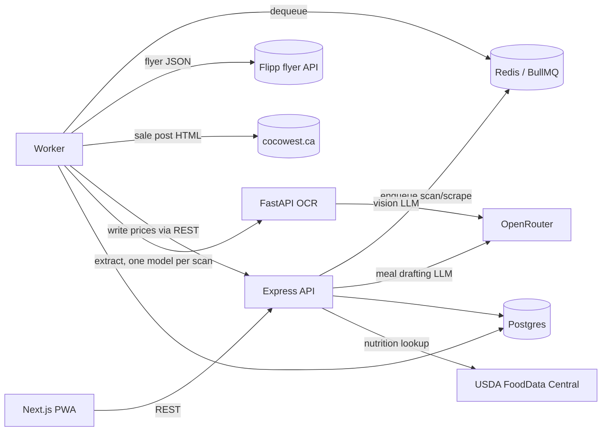
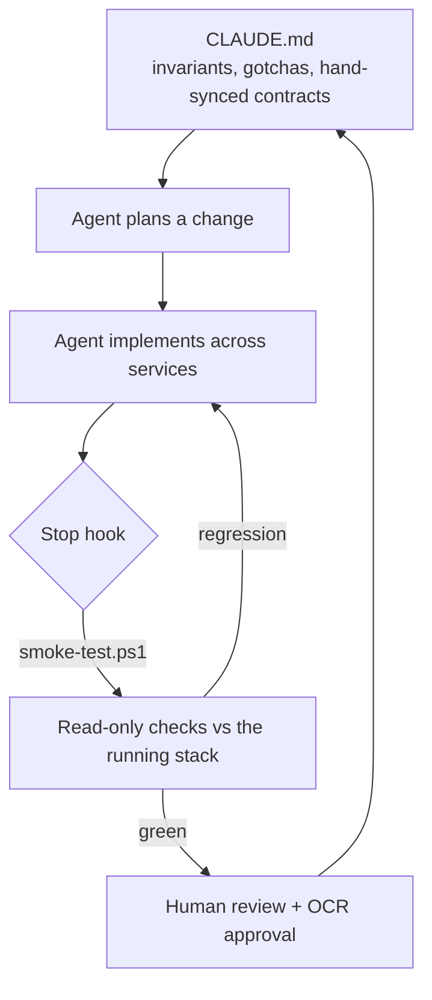

# FoodTracker

**Grocery price-intelligence + calorie tracking, built as a polyglot microservice stack — and developed with a disciplined agentic loop.**

FoodTracker turns photos of receipts and shelf tags into structured price data, tracks prices across stores, and doubles as a nutrition diary (with USDA FoodData Central lookup). It's a real, running system: six containers, three languages, a human-in-the-loop OCR pipeline, and a full audit/revert trail on every price mutation.

This README covers both **how the system works** and **how it's built** — the second half describes the agent loop used to develop it, which is the part I'm most deliberate about.

---

## Table of contents
- [Architecture](#architecture)
- [Data model](#data-model)
- [Running it](#running-it)
- [The agentic development loop](#the-agentic-development-loop)
- [Verification](#verification)
- [Conventions & invariants](#conventions--invariants)
- [Repo layout](#repo-layout)

---

## Architecture

Six containers orchestrated by `docker-compose.yml`. Each service is its own package — there is no root `package.json`, so services version and deploy independently.

| Service | Stack | Port | Role |
|---|---|---|---|
| `frontend` | Next.js 14 (App Router), TS, Tailwind | 3000 | PWA UI |
| `backend` | Express, TypeScript | 4000 | REST API; owns Postgres; enqueues jobs |
| `worker` | BullMQ, Node/TS | — | Processes the scraping **and** OCR queues |
| `ocr-service` | FastAPI, Python 3.12 | 8000 (loopback) | Vision-LLM extraction via OpenRouter |
| `db` | Postgres 15 | 5432 | Relational data |
| `redis` | Redis 7 | 6379 | BullMQ queues |



**One OCR ingestion path, ending in human review — nothing extracted is ever saved without a person approving it:**

**Intake → Staging → background OCR → Inbox** (`/scanner` → `/staging` → `/inbox`): the **Scanner** is a pure uploader — browser → `POST /api/scan-jobs` stores each image as a **staged** job (nothing runs yet). On **Staging** the user crops the ones that need it and sends them for processing (with an optional "use paid models" toggle) → the worker runs them through its **multi-model pool** → each result is held on a `scan_jobs` row → reviewed in the shared review grid in the **Inbox** for edit/approve/commit.

**Multi-model pool for throughput.** Free vision models are individually slow (~60–90s) and flaky, so the worker runs the `ocr-queue` in parallel — **all free models busy at once, each on a different scan** — and **retries a scan on the next model** if one fails. Model selection lives entirely in the worker (`worker/src/modelPool.ts`); the OCR service is a dumb per-model executor that sends the image **directly to one vision model** (no Tesseract), extracting structured fields with a reprompt-retry and graceful `unknown`+`raw_text` degradation. The four model lists (free/paid × image/text) are configured by env — see `.env.example`.

**One photo, several regions.** A capture isn't a single classification — a photo can hold a receipt next to a shelf tag, or a loose barcode, all at once. The model segments each photo into `captures[]` (`receipt | price_tag | barcode`, each with its own extracted items), and the worker fetches the catalog's tag vocabulary (`GET /api/tags`) to pass along so extracted items come back with `tags: string[]` — constrained to that vocabulary, never invented. The Inbox groups a mixed scan's review rows by which region they came from and lets you add/remove tags per row before committing.

Cropping uses a shared **`<ImageCropper>`** (also reused by the food-icon picker) on the **Staging** page, letting you crop a whole batch before sending it. The cropped image is what gets read and what committed prices reference; the full original is stored too and linked back from the crop (`images.original_image_id`), so nothing is lost. The Inbox shows **both** — the crop beside its uncropped original — so a crop that cut off the product name is obvious rather than a mystery.

**When a scan comes back useless, the Inbox is where it gets fixed** (the loop runs backwards, not into the bin):
- **Every model's output is kept — permanently.** The worker tries several models and stores only the best result on `scan_jobs.result`/`attempts`, but that gets overwritten on every re-run and cleared on re-crop. `scan_runs` is the append-only record underneath: one row per model call, ever, including before a restage — model, prompt version, tag vocabulary offered, full response — so nothing is lost across a re-crop or a re-process. The Inbox surfaces the current attempts in a collapsible "Raw model output" panel (auto-expanded when nothing parsed, including on **failed** jobs) plus the full run history underneath. A scan often reads fine and merely fails to *parse* — that text is now recoverable instead of discarded.
- **Send it back to Staging to re-crop.** `POST /api/scan-jobs/:id/restage` returns the job to `staged` and **restores the uncropped original**, so the re-crop starts from the full photo rather than tightening a bad one.

**Flyer scraping (two sources, one queue).** The worker drains a `scraping-queue` shared by both scrapers, branching on a `source` field in the job payload:
- **Flipp** (`source: 'flipp'`, default): hits Flipp's public flyer JSON API (`backflipp.wishabi.com` — **no headless browser**, the worker image is plain `node:20-slim`), fuzzy-matches merchants to the store name, and either logs one deal per tracked food (catalog mode) or every matching deal for a search query (query mode).
- **cocowest.ca** (`source: 'cocowest'`): given a cocowest.ca "weekend update" post URL, regex-parses the `` text of every product photo (item number, name, size, savings, expiry, price — no JSON API, no DOM parser needed) and logs a price for **every** item against a chosen store (typically "Costco"), creating foods (category `Costco`) for anything unmatched.

Both parse pack sizes into `amount`/`amount_unit` with a shared regex-based parser (`worker/src/scrape-common.ts`) and write each deal **through the backend REST API** so scraped prices get the same unit normalization, `food_prices` join, and audit entry as every other source. Each run is tracked on a `scrape_jobs` row (status/phase/progress + a per-price detail list) surfaced live on the `/scrapes` page; each logged price also saves its source image (Flipp clipping image or cocowest product photo, attached via `image_id`, shown in the same lightbox as receipt photos) and a link back to where it came from. Progress bookkeeping is written direct via the worker's pg pool; only the prices go through the audited API.

---

## Data model

Core entities are **stores, foods, price_logs**; calorie tracking adds **food_nutrition, consumption_logs, user_goals**; meal planning adds **meals, meal_ingredients**; budget tracking adds **receipts, budget_goals**. A few decisions worth calling out because they show up throughout the code:

- **Many-to-many by design.** Foods relate to prices and nutrition through join tables (`food_prices`, `food_macros`), so one price observation or nutrition profile can be shared across foods — two different products can point at the same nutrition facts, and editing them updates both. The origin `food_id` columns are retained for the audit trail and back-compat.
- **Audit + revert on every price mutation.** Create / update / delete each write a before/after JSONB snapshot in the same transaction as the mutation. Deletes are soft; reverts are themselves audited, so reverts are revertible.
- **History is immutable by snapshot.** Diary entries store the nutrient values computed *at log time* — editing a food's facts later never rewrites your history.
- **Sales expire, so sale prices do too.** A price logged as a sale carries the last day it's valid (`price_logs.sale_ends_at`), and once that day passes it stops counting as a current price — it drops out of the dashboard, best-price comparisons and meal costs, while History keeps it, because the sale really did happen. The date comes from whatever knows best: the scan reads it off the receipt or shelf tag, flyer scrapes take the flyer's own end date, and anything left over falls back to a configurable default duration (**Settings** page) that you can override per item while reviewing a scan. Without this a one-week special would be quoted as the item's price forever.
- **One array drives the schema.** The full nutrient column set is declared once (`NUTRIENT_FIELDS` in `backend/src/nutrition.ts`); the server builds its `INSERT` / `UPDATE` / `SUM` column lists from it. Adding a nutrient is a migration plus one array entry.
- **Meals are recipes, computed live.** A meal is a named list of ingredient amounts; its macros and cost are never stored — every read scales each ingredient's current facts and prices it against the food's latest tracked purchase (density-converting mass↔volume where needed). Logging a meal writes **one** diary entry (per-serving nutrients × portions, snapshotted like any other entry), and an LLM can draft a meal from selected "fridge" foods against macro targets — always returned as an unsaved draft the user reviews in the builder, same human-in-the-loop rule as OCR.
- **Foods carry an optional dashboard icon** (`foods.image_id`, nullable FK → `images`). When unset it falls back to the earliest image attached to one of the food's linked price logs, so most foods get a sensible thumbnail automatically; the user can override it with any saved scan/scrape photo or a freshly cropped upload.
- **The catalog is auditable in bulk.** The Costco scraper logs everything in a flyer post — including phones and luggage — so the **Audit** page lets you sweep the whole catalog, filter it, and archive, recategorize, tag, or **merge** items en masse. Archiving is a soft delete (`foods.deleted_at`): archived items disappear from every list but keep their data and can be restored. Merging collapses duplicate rows (three "pork tenderloin" entries → one) into a chosen survivor that inherits every source's prices, names, nutrition and tags — done by hand, or from an LLM "find duplicates" scan you review before anything merges.
- **Receipts track spending, not just prices.** Committing a receipt scan records **one** `receipts` row — the store source and the receipt's total cost — linked to its photo and scan job; you can also add receipts by hand for cash trips. The **Budget** page tracks the month's spend against an optional monthly target, broken down by store and over time. This is separate from `price_logs`: prices answer "what does milk cost?", receipts answer "how much did I spend this month?".

---

## Running it

Requires Docker and a `.env` (copy `.env.example`). Two API keys are optional but unlock features: `OPENROUTER_API_KEY` (OCR) and `FDC_API_KEY` (USDA nutrition lookup).

```bash
cp .env.example .env          # then fill in keys
docker compose up -d --build  # whole stack
```

- UI: http://localhost:3000
- API: http://127.0.0.1:4000/api/health
- Rebuild one service after editing it: `docker compose up -d --build backend`
- Follow logs: `docker compose logs -f worker`

**Schema note:** `db/schema.sql` only runs on a *fresh* Postgres volume. Migrations are written idempotently (`ADD COLUMN IF NOT EXISTS`, …) and applied to a running DB by hand via `psql` — documented in [CLAUDE.md](CLAUDE.md).

### Mobile (iOS / Android)

The frontend is a client-side SPA that talks to the REST API, so it packages into native App Store / Play Store apps via [Capacitor](https://capacitorjs.com/) with no rewrite. `frontend/next.config.js` produces a static bundle when `BUILD_TARGET=static`; `capacitor.config.ts` wraps `./out` in a native WebView shell.

```bash
cd frontend
npx cap add android          # and/or:  npx cap add ios   (iOS requires macOS)
NEXT_PUBLIC_API_URL=https://your-public-backend npm run mobile:sync   # build:mobile + cap sync
npm run mobile:open:android  # opens Android Studio / Xcode to build & sign
```

The one requirement is infrastructure, not code: the backend stack must be hosted publicly over **HTTPS**, and `NEXT_PUBLIC_API_URL` (baked in at build time) must point at it — a phone has no `localhost:4000`. The backend already sends permissive CORS for the Capacitor origin.

---

## The agentic development loop

This project is built with [Claude Code](https://claude.com/claude-code) as the primary implementer, driven by a **spec-first, verify-every-turn** loop rather than ad-hoc prompting. The scaffolding for that loop lives in the repo, not just in my head:



**1. `CLAUDE.md` is the living spec.** It's not a stale doc — it encodes the invariants an agent (or a new contributor) will otherwise get wrong: the three hand-synced cross-language contracts, the "schema.sql only runs on a fresh volume" trap, the pre-ES2015 iteration constraint in the frontend build, and the architectural rules (e.g. *there are exactly two input surfaces for price and macros; reuse them, don't fork*). Every non-obvious constraint learned during development is written back here, so the next change starts from accumulated context instead of rediscovering the same landmines.

**2. Every turn is verified.** A `Stop` hook (`.claude/settings.json`) runs `scripts/smoke-test.ps1` when the agent finishes a turn. The script hits the live backend and frontend with read-only checks — API contracts, the M:N join reads, diary micronutrient sums, USDA proxy, and every page returning 200. It's deliberately safe to run on a loop: it *skips* when the stack is down and only fails on a real regression, feeding the failure back to the agent to fix. No green, no done.

**3. Humans stay in the loop where it matters.** OCR is treated as an ingestion *supplement*, never an oracle: extracted items always pass through a review-and-approve step before they touch the database. The agent builds the pipeline; a person confirms the data.

**4. Single sources of truth over copy-paste.** Recurring logic is consolidated so a change lands in one place: two shared popup components for all price/macros entry (`PriceEditor`, `MacroEditor`), one `NUTRIENT_FIELDS` array driving both schema and SQL, one fuzzy matcher, one unit-normalization table per side of the wire. Where a contract *must* be duplicated across languages, it's labeled in-file and listed in `CLAUDE.md`.

The result is a loop where the agent can make cross-cutting changes (a new nutrient touches Postgres, Express, and two React surfaces) and immediately know whether it broke anything.

---

## Verification

There is no unit-test suite by design — this is an integration-heavy system where the meaningful signal is "does the running stack still honor its contracts." That signal is captured in `scripts/smoke-test.ps1`:

```bash
# runs automatically as a Stop hook; run it by hand any time:
powershell -File scripts/smoke-test.ps1
```

It gates on backend health, then asserts the foods/diary/goals/efficiency endpoints, the join-table reads, micronutrient aggregation, the scraper contract (unknown-store 404 + the `scrape-jobs` progress feed), the budget/receipts contract (summary shape + negative-total 400), the USDA lookup, and every page. Exit `0` = green, `2` = regression, and it no-ops when the stack isn't running.

The same checks run in **CI** (`.github/workflows/smoke.yml`) via a portable bash twin, `scripts/smoke-test.sh`, so the "every change is verified" guarantee holds for outside contributors too — not just on my machine. CI boots only the services the checks need (`db`, `redis`, `backend`, `frontend`) and runs in strict mode, so a stack that fails to boot is a failing build.

---

## Conventions & invariants

The full list lives in [CLAUDE.md](CLAUDE.md). The load-bearing ones:

- **Two input surfaces, reused everywhere.** `PriceEditor` and `MacroEditor` are the only ways to enter a price or nutrition facts — launched from the dashboard, diary, inbox, and history. Don't build a third form.
- **One shared `Modal` for every popup.** All popup overlays render through `frontend/src/components/Modal.tsx`, which portals into `document.body` so it isn't trapped by the page's `.animate-slide-up` CSS transform (a transformed ancestor becomes the containing block for `position: fixed` — the bug behind "modals open in the middle of the page"). Don't hand-roll a `fixed inset-0` overlay.
- **One named class vocabulary.** The recurring Tailwind strings (`.card`, `.field-input`, `.field-label`, `.btn`/`.btn-primary`/`.btn-secondary`) are defined once in `globals.css` `@layer components` and reused across every page; per-site padding/width/accent stays as inline utilities (which still override the component class because they sit in a later layer). Reuse them instead of re-pasting the raw utilities. Major JSX regions carry a `{/* ═══ Section: … ═══ */}` banner so they're easy to point at.
- **Three hand-synced contracts** (OCR response shape — now a composite `captures[]` per photo — unit tables, nutrition scaling) are duplicated across languages and kept in sync by hand; each file says so.
- **Frontend build targets pre-ES2015 iteration** — use `Array.from(...)`, never `[...set]`.
- **Every "current price" query filters `deleted_at IS NULL`.**
- **`consumed_at` is a naive local timestamp** — the client owns timezone handling.

---

## Repo layout

```
backend/       Express API, audit trail, unit + nutrition + FDC logic
frontend/      Next.js PWA (dashboard, meals, diary, scanner, staging, inbox, scrapes, history, budget, audit, settings)
worker/        BullMQ consumer: Flipp + cocowest.ca flyer scrapers + OCR job runner
ocr-service/   FastAPI vision-LLM extraction
db/schema.sql  Idempotent schema + seed data
scripts/       smoke-test.ps1 (the verification loop)
.claude/       settings.json — the Stop hook wiring the loop
CLAUDE.md      The living spec: invariants, gotchas, architecture
ROADMAP.md     Candidate future features (shopping lists, weekly planner, …)
```
